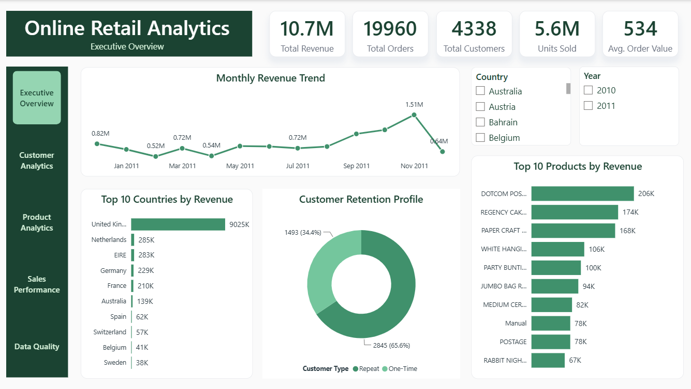
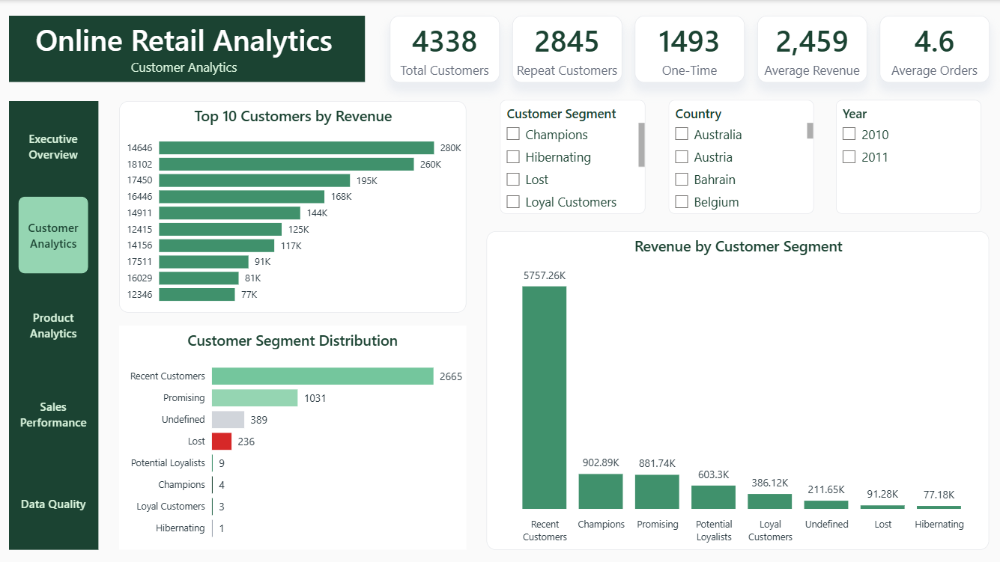
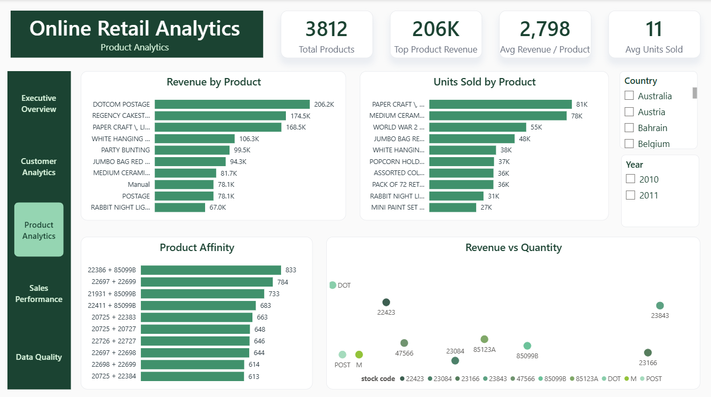
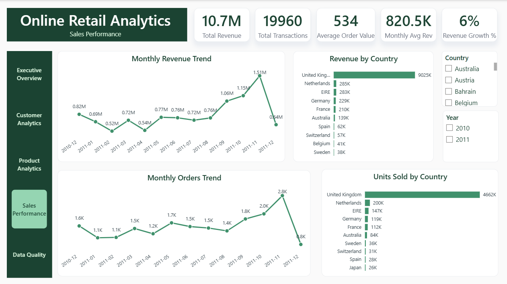
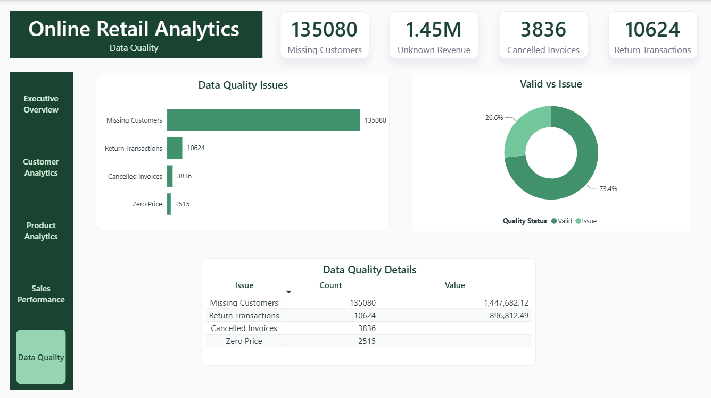

# 🛒 Online Retail Analytics Dashboard

An interactive **Retail Sales & Customer Analytics Dashboard** built using **Power BI, PostgreSQL, SQL, Power Query, and DAX** to transform transactional retail data into meaningful business insights.

The dashboard provides an analytical view of sales performance, customer behavior, product performance, RFM customer segmentation, product affinity, and data quality across five Power BI report pages.

---

## 📑 Table of Contents

- Project Overview
- Business Objectives
- Dataset
- Data Preparation
- Data Model
- Dashboard Pages
- Project Highlights
- Dashboard KPIs
- SQL Business Analysis
- RFM Customer Segmentation
- Data Quality Analysis
- DAX Measures
- Business Questions Answered
- Key Business Insights
- Skills Demonstrated
- Business Value
- Repository Structure
- How to Explore the Dashboard
- Future Improvements
- Project Summary
- Author

---

## 📌 Project Overview

The **Online Retail Analytics Dashboard** is an end-to-end Business Intelligence project designed to analyze transactional retail data and transform it into actionable business insights.

The project combines **PostgreSQL**, **SQL**, **Power Query**, **DAX**, and **Power BI** to prepare, analyze, model, and visualize retail transaction data.

The dashboard focuses on four major analytical areas:

- Sales Performance
- Customer Analytics
- Product Analytics
- Data Quality

The project also incorporates **RFM Customer Segmentation** and **Product Affinity Analysis** to provide deeper customer and product-level insights.

---

## 🎯 Business Objectives

- Monitor overall retail sales performance.
- Analyze revenue and transaction trends over time.
- Identify top-performing countries and products.
- Analyze customer purchasing behavior.
- Compare repeat and one-time customers.
- Identify high-value customers.
- Segment customers using RFM analysis.
- Identify customer groups requiring retention attention.
- Analyze products frequently purchased together.
- Compare product revenue and sales quantity.
- Identify missing customer information.
- Measure revenue associated with unknown customers.
- Identify cancelled invoices, return transactions, and zero-price records.
- Support data-driven business decisions through interactive analytics.

---

## 📂 Dataset

The project is based on the **Online Retail transactional dataset**.

The dataset contains transaction-level retail information, including:

- Invoice Number
- Stock Code
- Product Description
- Quantity
- Invoice Date
- Unit Price
- Customer ID
- Country

The original dataset contains **541,909 transaction records** before data quality filtering and analytical transformations.

The dataset includes both complete and incomplete records, allowing the project to combine business analysis with dedicated data quality analysis.

---

## 🧹 Data Preparation

Data preparation and transformation were performed using **PostgreSQL, SQL, and Power Query**.

Key preparation activities included:

- Data type validation
- Invoice date transformation
- Revenue calculation
- Transaction-level analysis
- Customer-level aggregation
- RFM feature preparation
- Identification of missing Customer IDs
- Identification of cancelled invoices
- Identification of return transactions
- Identification of zero-price records
- Preparation of analytical tables for Power BI

The raw transactional data was retained to support the dedicated Data Quality analysis.

---

## 🗂️ Data Model

The Power BI model combines transactional and analytical tables to support sales, customer, product, date, and segmentation analysis.

### Main Tables

- `Sales_Data`
- `Customers`
- `RFM`
- `Date`
- Raw Online Retail data

The model supports customer-level and transaction-level analysis through `CustomerID` relationships.

The `RFM` table contains:

- Recency
- Frequency
- Monetary
- RFM Score
- Customer Segment

The `Date` table supports time-based analysis, including monthly revenue and transaction trends.

---

# 📊 Dashboard Pages

The dashboard consists of **five interactive report pages**, each focused on a specific analytical area.

---

## 📈 1. Executive Overview



Provides a high-level view of overall retail performance.

### Highlights

- Total Revenue
- Total Orders
- Total Customers
- Units Sold
- Average Order Value
- Monthly Revenue Trend
- Top 10 Countries by Revenue
- Top 10 Products by Revenue
- Customer Retention Profile
- Interactive Country Filter
- Interactive Year Filter

---

## 👥 2. Customer Analytics



Analyzes customer purchasing behavior, customer value, and customer segmentation.

### Highlights

- Total Customers
- Repeat Customers
- One-Time Customers
- Average Revenue per Customer
- Average Orders per Customer
- Top 10 Customers by Revenue
- Customer Segment Distribution
- Revenue by Customer Segment
- Customer Segment Slicer
- Interactive Country Filter
- Interactive Year Filter

---

## 📦 3. Product Analytics



Analyzes product performance, sales volume, purchasing relationships, and product-level revenue.

### Highlights

- Total Products
- Top Product Revenue
- Average Revenue per Product
- Average Units Sold
- Revenue by Product
- Units Sold by Product
- Product Affinity
- Revenue vs Quantity
- Interactive Country Filter
- Interactive Year Filter

### Product Affinity

The Product Affinity analysis identifies product pairs that were frequently purchased together.

The dashboard presents the **Top 10 Product Pairs** generated through SQL-based product pair analysis.

This analysis can support:

- Cross-selling opportunities
- Product bundling
- Promotional strategies
- Product recommendation analysis

---

## 📈 4. Sales Performance



Provides a detailed view of revenue and transaction performance over time and across countries.

### Highlights

- Total Revenue
- Total Transactions
- Average Order Value
- Monthly Average Revenue
- Revenue Growth %
- Monthly Revenue Trend
- Monthly Transaction Trend
- Revenue by Country
- Units Sold by Country
- Interactive Country Filter
- Interactive Year Filter

---

## 🧪 5. Data Quality



Provides a dedicated view of data quality issues identified in the raw transactional dataset.

### Highlights

- Missing Customer IDs
- Revenue from Unknown Customers
- Cancelled Invoices
- Return Transactions
- Zero Price Records
- Data Quality Issues
- Valid vs Issue Distribution
- Data Quality Details Matrix

---

## ⭐ Project Highlights

- Five-page interactive Power BI dashboard
- PostgreSQL-based SQL analysis
- Customer RFM segmentation
- Product Affinity analysis
- Sales performance analysis
- Customer behavior analysis
- Product performance analysis
- Dedicated data quality analysis
- Dynamic DAX measures
- Interactive slicers and filtering
- Consistent dashboard design
- Business-focused data storytelling

---

## 📊 Dashboard KPIs

The dashboard uses dynamic KPI cards to monitor key business metrics.

| KPI | Description |
|---|---|
| Total Revenue | Total revenue generated from retail transactions |
| Total Orders | Number of distinct invoices/orders |
| Total Customers | Number of unique customers |
| Units Sold | Total quantity of products sold |
| Average Order Value | Average revenue generated per order |
| Repeat Customers | Customers with multiple purchasing transactions |
| One-Time Customers | Customers with a single purchasing transaction |
| Total Products | Number of distinct products |
---

## 🗃️ SQL Business Analysis

The analytical work was performed using **PostgreSQL**.

SQL was used to prepare analytical datasets, perform business analysis, and answer key business questions before integrating the results into Power BI.

### SQL Analysis Areas

- RFM Customer Segmentation
- Product Affinity Analysis
- Monthly Sales Performance
- Customer Retention Analysis
- Product Performance Analysis
- Data Quality Analysis

### SQL Techniques Demonstrated

- SELECT
- WHERE
- GROUP BY
- HAVING
- DISTINCT
- CASE Statements
- Aggregate Functions
- Common Table Expressions (CTEs)
- Window Functions
- Date Functions
- Conditional Aggregation
- Customer-Level Aggregation
- Product Pair Analysis

The complete SQL analysis is available in:

`SQL/Online_Retail_SQL_Analysis.sql`

---

## 🧮 RFM Customer Segmentation

RFM analysis was implemented to evaluate customer purchasing behavior across three dimensions:

### Recency

Measures how recently a customer made a purchase.

### Frequency

Measures the number of distinct invoices associated with a customer.

### Monetary

Measures the total revenue generated by a customer.

The RFM scores were combined to classify customers into meaningful customer segments and support customer value analysis.

### Customer Segments

- Champions
- Loyal Customers
- Potential Loyalists
- Recent Customers
- Promising
- At Risk
- Hibernating
- Lost
- Undefined

The segmentation helps identify high-value customers, loyal customers, and customers who may require targeted retention strategies.

---

## 🧪 Data Quality Analysis

A dedicated **Data Quality** page was developed to identify and quantify issues within the raw transactional dataset.

The raw dataset was intentionally retained so that data quality issues could be measured without removing the original records from the analysis.

### Quality Checks

- Missing Customer IDs
- Revenue from Unknown Customers
- Cancelled Invoices
- Return Transactions
- Zero Price Records

### Missing Customer IDs

Measures the number of raw transaction records where `CustomerID` is missing.

### Revenue from Unknown Customers

Measures the revenue generated by transactions where `CustomerID` is missing and therefore cannot be attributed to an identified customer.

### Cancelled Invoices

Identifies cancelled transactions using the cancellation pattern in the invoice number.

### Return Transactions

Identifies transactions with negative quantities, representing returned items.

### Zero Price Records

Identifies transaction records where the unit price is zero.

### Data Quality Visualization

The Data Quality page combines KPI cards and visual analysis to provide a clear overview of identified issues.

It includes:

- Data Quality Issues
- Valid vs Issue Records
- Return Value
- Data Quality Details Matrix
- Quality Status Distribution

> Data quality issue categories are not mutually exclusive. A single transaction may contain more than one issue, so individual issue counts should not be added together to represent the total number of unique problematic records.

---

## ⚡ DAX Measures

Custom **DAX measures** were developed to support dynamic calculations and interactive reporting across the Power BI dashboard.

### Sales Measures

- Total Revenue
- Total Orders
- Total Transactions
- Total Units Sold
- Average Order Value
- Monthly Average Revenue
- Revenue Growth %

### Customer Measures

- Total Customers
- Repeat Customers
- One-Time Customers
- Average Revenue per Customer
- Average Orders per Customer

### Product Measures

- Total Products
- Top Product Revenue
- Average Revenue per Product
- Average Units Sold

### Data Quality Measures

- Missing Customers
- Revenue from Unknown Customers
- Cancelled Invoices
- Return Transactions
- Return Value
- Zero Price Records

The measures dynamically respond to report filters, slicers, and cross-filtering interactions.

---

## ❓ Business Questions Answered

The dashboard and SQL analysis answer a wide range of business questions across sales performance, customer behavior, product performance, and data quality.

### Sales Performance

- What is the total revenue generated from the retail transactions?
- How does revenue change over time?
- How many orders and transactions were recorded?
- What is the Average Order Value?
- What is the monthly average revenue?
- How does the number of transactions change from month to month?
- Which countries generate the highest revenue?
- Which countries generate the highest number of units sold?
- Which products generate the highest revenue?

### Customer Analytics

- How many customers are represented in the customer analysis?
- How many customers are repeat customers?
- How many customers purchased only once?
- What is the average revenue generated per customer?
- What is the average number of orders per customer?
- Which customers generate the highest revenue?
- Which customer segments contribute the most revenue?
- Which RFM segments contain the highest-value customers?
- Which customer groups may require retention attention?

### Product Analytics

- How many distinct products are available in the dataset?
- Which products generate the highest revenue?
- Which products have the highest sales volume?
- What is the average revenue per product?
- What is the average number of units sold per product?
- Which products are frequently purchased together?
- What are the strongest product pairs based on purchase frequency?
- How does product quantity relate to revenue?

### Data Quality

- How many raw records have missing Customer IDs?
- How much revenue is generated by transactions with unknown customers?
- How many cancelled invoices exist?
- How many return transactions were identified?
- What is the total value associated with returned transactions?
- How many records contain zero-price products?
- How are records distributed between valid and identified issue records?
- What are the main data quality issues affecting the raw transactional dataset?

---

## 💡 Key Business Insights

The analysis provides business insights across sales, customers, products, and data quality.

### Sales Insights

- Revenue performance varies across countries, allowing the business to identify its strongest geographic markets.
- Revenue and transaction trends provide visibility into changes in business performance over time.
- The Average Order Value provides additional context beyond transaction volume by showing the average revenue generated per order.
- Product-level revenue analysis highlights the products that contribute most significantly to overall sales.

### Customer Insights

- Repeat customers represent an important customer group because they purchase more than once and can contribute significantly to overall revenue.
- One-time customers represent an opportunity for retention and repeat-purchase strategies.
- Revenue is concentrated among a smaller group of higher-value customers.
- RFM segmentation provides a structured way to distinguish valuable, loyal, promising, and at-risk customer groups.
- Customer segment analysis can support more targeted customer engagement and retention strategies.

### Product Insights

- Product revenue is not evenly distributed across the product catalog.
- A relatively small number of products contributes a significant portion of total revenue.
- Comparing revenue and units sold helps identify products with different levels of sales volume and revenue contribution.
- Product Affinity analysis identifies products that are frequently purchased together.
- Product pair analysis can support cross-selling, bundling, and promotional strategies.

### Data Quality Insights

- A substantial number of raw transaction records contain missing Customer IDs.
- Transactions without Customer IDs generate revenue that cannot be directly attributed to an identified customer.
- Cancelled invoices and return transactions need to be considered separately when evaluating sales performance.
- Zero-price records represent another data quality issue that should be monitored before using the data for certain business analyses.
- A dedicated Data Quality page provides visibility into these issues instead of silently removing them from the raw dataset.

> Data quality issue categories are not mutually exclusive. A single transaction may contain more than one issue, so individual issue counts should not be added together to calculate the total number of unique problematic records.

---

## 🛠️ Skills Demonstrated

### Business Intelligence

- Business Analysis
- Business Requirements Analysis
- KPI Development
- Dashboard Design
- Data Storytelling
- Customer Segmentation
- Data Quality Analysis
- Interactive Reporting

### PostgreSQL / SQL

- SQL Query Development
- Data Filtering
- Data Aggregation
- GROUP BY
- HAVING
- DISTINCT
- CASE Statements
- Aggregate Functions
- Common Table Expressions (CTEs)
- Window Functions
- Date Functions
- Conditional Aggregation
- Customer-Level Analysis
- RFM Analysis
- Product Affinity Analysis
- Customer Retention Analysis
- Data Quality Analysis

### Power BI

- Data Modeling
- DAX Measures
- KPI Development
- Interactive Dashboards
- Slicers
- Cross-filtering
- Page Navigation
- Data Quality Reporting
- Customer Segmentation
- Product Analysis
- Sales Analysis
- Interactive Visualizations

### Power Query

- Data Cleaning
- Data Transformation
- Data Type Management
- Query Referencing
- Data Preparation

### Data Visualization

- KPI Cards
- Line Charts
- Bar Charts
- Column Charts
- Donut Charts
- Scatter Charts
- Matrix Visuals
- Interactive Slicers
- Conditional Formatting

---

## 💼 Business Value

The Online Retail Analytics Dashboard provides a centralized analytical view of retail performance and enables stakeholders to move from raw transaction data to actionable business insights.

The solution supports:

- Monitoring overall revenue performance.
- Tracking transaction and order activity.
- Monitoring monthly sales trends.
- Identifying high-performing countries.
- Identifying top-performing products.
- Understanding customer purchasing behavior.
- Distinguishing repeat customers from one-time customers.
- Identifying high-value customer segments.
- Supporting customer retention strategies through RFM analysis.
- Identifying cross-selling opportunities through Product Affinity analysis.
- Comparing product revenue with sales quantity.
- Monitoring important data quality issues.
- Identifying revenue that cannot be attributed to known customers.
- Supporting data-driven business decision-making.

---

## 📂 Repository Structure

```text
Online-Retail-Analytics-Dashboard
│
├── README.md
│
├── Assets
│   ├── 1_Executive_Overview.png
│   ├── 2_Customer_Analytics.png
│   ├── 3_Product_Analytics.png
│   ├── 4_Sales_Performance.png
│   └── 5_Data_Quality.png
│
├── Dashboard
│   └── Online_Retail_Analytics.pdf
│
└── SQL
    └── Online_Retail_SQL_Analysis.sql
```
---

## 🚀 How to Explore the Dashboard

1. Clone or download the repository.
2. Open the dashboard PDF located in the `Dashboard` folder.
3. Explore the five dashboard pages included in the PDF.
4. Review the dashboard screenshots available in the `Assets` folder.
5. Explore the PostgreSQL SQL analysis in the `SQL` folder.
6. Review the SQL queries used for RFM Customer Segmentation, Product Affinity Analysis, Sales Performance, Customer Analysis, Product Analysis, and Data Quality Analysis.
7. Review this README to understand the project workflow, analytical objectives, KPIs, business questions, and key insights.

> **Note:** The Power BI `.pbix` file is intentionally excluded from the repository. The repository contains the dashboard output, dashboard screenshots, SQL analysis, and project documentation.

---

## 🔮 Future Improvements

Potential enhancements for future versions include:

- Customer Lifetime Value (CLV) Analysis
- Customer Cohort Analysis
- Customer Churn Analysis
- Revenue Forecasting
- Product Recommendation Analysis
- Profitability Analysis
- Geographic Sales Visualization
- Power BI Service Deployment
- Automated Data Refresh
- Row-Level Security (RLS)
- Mobile Dashboard Optimization
- Advanced Customer Segmentation

These improvements could extend the project from descriptive and diagnostic analytics toward predictive and prescriptive analytics.

---

## 📚 Project Summary

The **Online Retail Analytics Dashboard** demonstrates an end-to-end Data Analytics and Business Intelligence workflow.

The project starts with raw transactional retail data and uses **PostgreSQL and SQL** for analytical processing, followed by **Power Query** for data preparation, **Power BI data modeling**, and **DAX** for dynamic business calculations.

The final Power BI solution provides five analytical pages covering:

- Executive Overview
- Customer Analytics
- Product Analytics
- Sales Performance
- Data Quality

The project also includes advanced analytical components such as:

- RFM Customer Segmentation
- Product Affinity Analysis
- Customer Retention Analysis
- Product Performance Analysis
- Data Quality Monitoring

By combining SQL-based analysis with interactive Power BI reporting, the project transforms transactional retail data into a structured Business Intelligence solution that helps stakeholders monitor performance, understand customer behavior, evaluate products, and identify data quality issues.

---

## 👤 Author

### Omnia Mohamed Abdellah

**Data Analyst | Business Intelligence Enthusiast**

- 💼 LinkedIn: [Omnia Mohamed](https://www.linkedin.com/in/omnia26)
- 🐙 GitHub: [omnia-mohamed26](https://github.com/omnia-mohamed26)

---

## ⭐ Support

If you found this project useful, please consider giving it a **Star ⭐** on GitHub.
